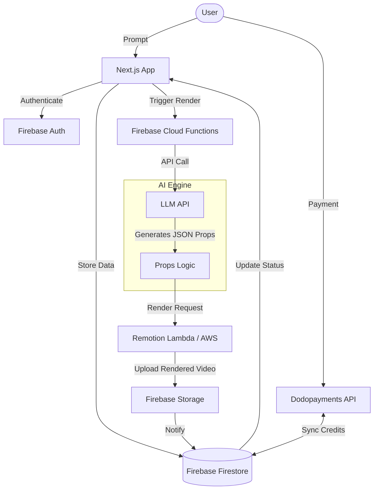

# 🚀 SaaS VideoGen: AI-Powered Remotion Platform

A comprehensive strategy and architecture plan for building a scalable SaaS that generates professional videos from simple prompts using **Remotion**, **Firebase**, and **Generative AI**.

---

## 1. Project Vision
**VideoGen AI** empowers users to create high-quality social media ads, tutorials, and personalized videos simply by describing their needs. The platform uses LLMs (like GPT-4o) to handle the scriptwriting and "visual direction," which is then translated into a dynamic Remotion composition.

---

## 2. Tech Stack Overview

| Component | Technology | Role |
| :--- | :--- | :--- |
| **Frontend** | **Next.js** (App Router) | Landing page, User Dashboard, Video Editor UI. |
| **Styling** | **Tailwind CSS** | Modern, responsive interface. |
| **Video Engine** | **Remotion** | Programmatic video generation. |
| **Authentication** | **Firebase Auth** | Google, GitHub, and Email/Password sign-in. |
| **Database** | **Firestore** | Project data, user settings, and usage metrics. |
| **Storage** | **Firebase Storage** | Hosting rendered videos and user-uploaded assets (images/audio). |
| **Payments** | **Dodopayments** | Subscription management, checkouts, and logic for "Video Credits." |
| **Gen AI** | **OpenAI / Anthropic** | Script generation, asset selection, and Remotion `inputProps` logic. |
| **Deployment** | **AWS Lambda** (Remotion) | High-performance, parallel video rendering at scale. |

---

## 3. Core Features

- **💡 AI Prompt-to-Video**: Users enter a prompt (e.g., "A 30-sec ad for a coffee shop"), and the AI generates the script, chooses colors, and picks animations.
- **🎨 Dynamic Template Control**: AI-generated `inputProps` allow for infinitely varied videos from a set of core master compositions.
- **⚡ Fast Rendering**: Offload heavy rendering tasks to Remotion Lambda to ensure the web server stays responsive.
- **💳 Credit-Based System**: Integrated via Dodopayments. Users buy "minutes" or "renders."
- **📂 User Dashboard**: Manage projects, download historical renders, and track usage.

---

## 4. System Architecture

---

## 5. Database Schema (Firestore)

### `/users/{userId}`
- `email`: string
- `subscriptionStatus`: "active" | "canceled" | "none"
- `credits`: number
- `stripeCustomerId`: string (for Dodopayments sync)

### `/projects/{projectId}`
- `userId`: string
- `title`: string
- `prompt`: string
- `status`: "draft" | "rendering" | "completed" | "failed"
- `videoUrl`: string (from Firebase Storage)
- `inputProps`: object (JSON keys for Remotion: script, colors, scenes)
- `createdAt`: timestamp

---

## 6. AI & Remotion Orchestration (The "Secret Sauce")

The most effective way to combine AI with Remotion is via **Schema-Driven Video Generation**:

1. **Define a Zod Schema**: Create a robust schema for your Remotion composition (e.g., `Scene[]`, `colors`, `voiceoverText`).
2. **AI Instruction**: Prompt the LLM to output ONLY a JSON object that strictly adheres to your Zod schema.
3. **Validation**: Use `@remotion/zod-types` to validate the AI output before passing it into the composition.
4. **Composition**: Remotion reads the AI-generated JSON and renders the visual components accordingly.

---

## 7. Implementation Phases

### Phase 1: Foundation (MVP)
- [ ] Initialize Next.js with Firebase Auth.
- [ ] Set up basic Remotion Composition in `/src/remotion`.
- [ ] Connect Firestore to store simple "Project" documents.

### Phase 2: AI Integration
- [ ] Build a Server Action/API route to call OpenAI.
- [ ] Prompt engineering: Instruct AI to generate the `inputProps` JSON.
- [ ] Test the pipeline: Prompt -> JSON -> Local Remotion Preview.

### Phase 3: Scaling & Payments
- [ ] Integrate **Dodopayments** for subscription billing.
- [ ] Set up **Remotion Lambda** on AWS for remote rendering.
- [ ] Implement a webhook listener to update Firestore when a render is finished.

### Phase 4: UI Refinement & SEO
- [ ] Design a premium landing page (using Tailwind/Framer Motion).
- [ ] Add real-time "Rendering Progress" bars using Firestore listeners.
- [ ] SEO optimization and social tags.

---

## 8. Best Practices & Security

- **Environment Variables**: Never store Firebase Admin keys or OpenAI keys on the client. Use Server-side logic.
- **Rate Limiting**: Use Firebase Functions for AI calls to prevent API abuse.
- **Rendering Costs**: Monitor AWS Lambda usage carefully to ensure the SaaS pricing matches infrastructure costs.
- **Remotion Safety**: Use `staticFile` and ensure third-party assets (images/videos) are sanitized before being processed by the renderer.

---

### **Next Step Suggestions:**
1. Let's start by setting up the Firebase Project config.
2. I can create the first AI-driven Remotion composition for you.
3. We can implement the Dodopayments checkout flow.
