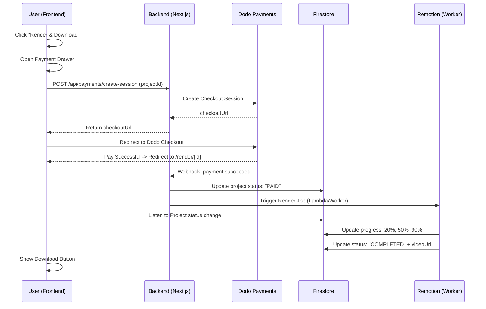

# Dodo Payments Integration Plan 💳

This document outlines the high-level architecture and implementation steps to integrate **Dodo Payments** into the SaaS Video Generator. The goal is to create a seamless "Pay-to-Render" workflow.

## 🏗️ High-Level Architecture



---

## 🛠️ Implementation Details

### 1. The Render Drawer (`src/components/Editor/RenderDrawer.tsx`)
A premium UI component that slides out when the user is ready.
- **Project Summary**: Thumbnail, duration, and style.
- **Pricing**: Dynamic price based on duration (if needed).
- **CTA**: "Unlock & Render Video" button.
- **State**: Handles the loading state while the Dodo checkout session is being generated.

### 2. Backend: Session Creator (`src/app/api/payments/create-session/route.ts`)
- **Validation**: Ensure the project actually exists and belongs to the user.
- **Dodo Integration**: 
    - Initialize Dodo Client.
    - Create a session with `metadata: { projectId }`.
    - Return the `url` to the frontend.

### 3. Backend: Webhook Handler (`src/app/api/payments/webhook/route.ts`)
- **Verification**: Must verify the Dodo signature to prevent spoofing.
- **Logic**:
    - Extract `projectId` from metadata.
    - Update Firestore: `status: "PAID"`, `paymentId: "xxx"`.
    - **Trigger Render**: Immediately dispatch the Remotion render task.

### 4. Firestore Schema Updates
We need to add/update fields in the `projects` collection:
```typescript
{
  status: 'EDITING' | 'PAID' | 'RENDERING' | 'COMPLETED' | 'FAILED',
  payment: {
    sessionId: string,
    amount: number,
    status: 'pending' | 'succeeded',
    completedAt: timestamp
  },
  render: {
    progress: number, // 0 - 100
    videoUrl: string,
    error?: string
  }
}
```

### 5. The Render Page (`src/app/render/[id]/page.tsx`)
A dedicated page that provides feedback during the render process.
- **UI**: High-quality progress bars, funny "rendering quotes," or a preview of frames as they are generated.
- **Real-time**: Leverages `onSnapshot` from Firebase to update the UI instantly as the backend worker finishes.

---

## 🔒 Security & Edge Cases

| Case | Handling Strategy |
| :--- | :--- |
| **User closes tab after payment** | The Webhook handles the heavy lifting. The render starts even if the user is offline. |
| **Payment fails** | Inform user via UI and allow them to retry from the drawer. |
| **Render fails** | Capture the error in Firestore and show a "Support" button or automatic refund option. |
| **Direct Access** | `/render/[id]` should check if `status === 'PAID'` before showing progress or download links. |

---

## 🚀 Environment Variables Required
```bash
DODO_API_KEY=your_live_key
DODO_WEBHOOK_SECRET=your_webhook_secret
NEXT_PUBLIC_APP_URL=https://yourdomain.com
```
